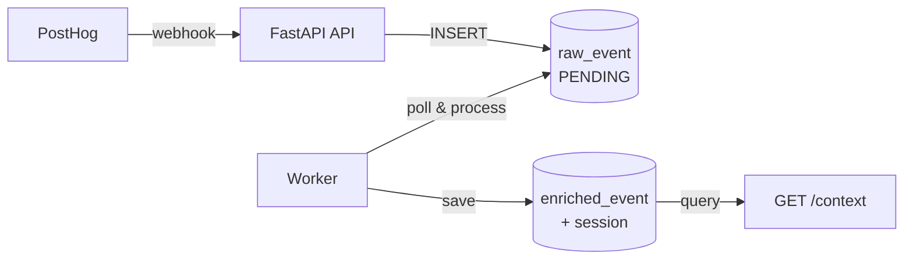
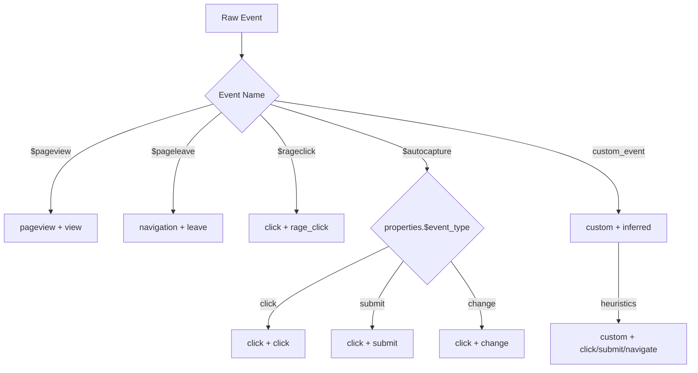
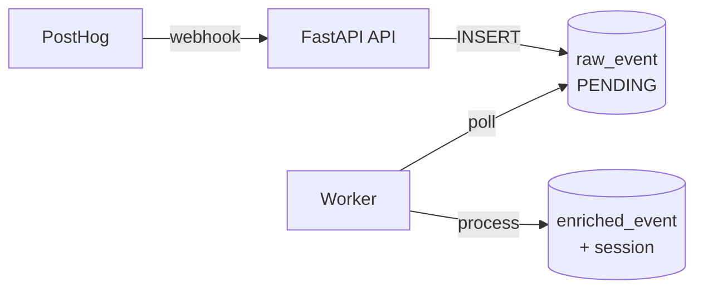
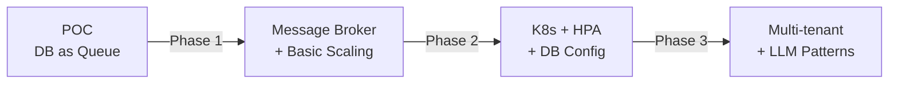

# PostHog Sessions Insight - Event Processing Pipeline

## Table of Contents

- [Overview](#overview)
- [Quick Start](#quick-start)
- [System Architecture](#system-architecture)
- [Event Processing](#event-processing)
- [Pattern Detection](#pattern-detection)
- [LLM Context Generation](#llm-context-generation)
- [Configuration](#configuration)
- [Scaling to Production](#scaling-to-production)
- [Development](#development)

---


> **TL;DR:** 
> 
> Real-time pipeline that ingests PostHog events, enriches them with semantic labels, detects behavioral patterns, and exposes LLM-ready context via API. Built with FastAPI + PostgreSQL + async workers. Demo-ready in 2 minutes with docker-compose.
> [Scaling to Production](#scaling-to-production)

**Task Requirements → Implementation:**
- ✅ Real-time ingestion → Webhook endpoint + async worker processing
- ✅ Normalize & enrich → Classification system + semantic label generation
- ✅ LLM-friendly format → Structured JSON with human-readable labels
- ✅ Context API → `GET /session/context/{user_id}` with events + summary + patterns
- ✅ Production scaling plan → Message broker migration path + K8s deployment strategy


## Overview

### What It Does

A production-ready POC that transforms raw PostHog analytics events into structured, LLM-friendly context for AI chatbots. The system ingests clicks, pageviews, and custom events in real-time, enriches them with semantic labels, detects behavioral patterns, and exposes this data through a simple API.

**Problem it solves:** Modern chatbots need to understand what users are doing in your application to provide contextual help. PostHog captures raw events, but they're noisy and machine-oriented. This pipeline bridges that gap.

### Key Features

- **Real-time ingestion** - Webhook-based event capture from PostHog
- **Semantic enrichment** - Converts raw events like `$autocapture` into readable labels: "Clicked 'Upgrade' button on billing page"
- **Session tracking** - Groups events into user sessions with automatic summarization
- **Pattern detection** - Identifies behavioral patterns (e.g., checkout abandonment, billing hesitation)
- **LLM-ready API** - Returns structured JSON context that drops directly into chatbot prompts
- **Async processing** - Worker-based pipeline with individual transaction isolation

### Tech Stack
| FastAPI + Python 3.11+ | PostgreSQL + SQLAlchemy Core + asyncpg | Docker Compose |

## Quick Start

### Running the Demo

1. **Clone and navigate to the project:**
```bash
   git clone <repository-url>
   cd posthog-session-insights
```

2. **Start all services:**
```bash
   docker-compose up --build
```

   This will start:
   - PostgreSQL database
   - FastAPI application (port 8000)
   - Background worker for event processing
   - Demo client (feeds sample events automatically)

3. **Watch the pipeline in action:**
   
   The demo client will automatically send sample events to the API. You'll see:
```
   ✓ Event 1: 202
   ✓ Event 2: 202
   ✓ Event 3: 202
   ...
   Complete!
   Sent: 45 events
   Successful: 45 (100.0%)
```

   Meanwhile, the worker processes these events in real-time:
```
   Processing 10 events...
   Processing 15 events...
```

4. **Explore the API with Swagger UI** (recommended):
   
   Open [http://localhost:8000/docs](http://localhost:8000/docs) in your browser.
   
   Try the **GET /session/context/{user_id}** endpoint with one of the pre-loaded users:
   - `019aff19-86cb-7abd-b27e-5e3a34fc85f2`
   - `019aff1e-0ace-7a5c-80a8-cfdac2d7e743`

   You'll see enriched context with:
   - Recent events with semantic labels
   - Session summary
   - Detected behavioral patterns

   **Why Swagger?** Interactive testing, built-in documentation, and example responses all in one place.

5. **Or use curl if you prefer CLI:**
```bash
   curl http://localhost:8000/session/context/019aff19-86cb-7abd-b27e-5e3a34fc85f2 | jq
```


6. **Verify the pipeline:**
```bash
   # Check API health
   curl http://localhost:8000/health
   
   # View processed events count
   docker-compose logs worker | grep "Processing"
```

### Stopping the System
```bash
docker-compose down
```

To completely reset (delete all data):
```bash
docker-compose down -v
```

### Advanced: Simulating Real Traffic

The default demo uses **deterministic events** that guarantee meaningful patterns will be detected. This is perfect for demonstrations.

If you want to simulate **realistic, unpredictable traffic** with varying frequency (traffic waves), follow these steps:
1. Replace `docker-compose.yml` file with the `demo/docker-compose.yml` version (you can copy-paste)
3. Run `docker-compose up --build`

**Note:** The randomized client sends events with random timing and order, so specific patterns may or may not be detected depending on the sequence. It's designed to stress-test the system, not to showcase specific features.
I suggest trying the deterministic version first.

## System Architecture

### Component Overview


**Flow:**
1. **Ingestion:** PostHog → API → `raw_event` table (status=PENDING)
2. **Processing:** Worker polls PENDING events → enriches → saves to `enriched_event` + `session` → marks DONE
3. **Retrieval:** `GET /session/context/{user_id}` returns enriched data for LLM


### Worker Architecture

- **Polling:** Fetches 200 PENDING events every 1 second
- **Concurrency:** Processes max 10 events in parallel (asyncio + semaphore)
- **Isolation:** Each event in its own transaction (if one fails, others succeed)
- **Graceful shutdown:** Handles SIGTERM/SIGINT

**Tech:** SQLAlchemy Core + asyncpg, full async/await throughout.


## Event Processing

### Classification Strategy

Every raw PostHog event is classified into two dimensions:


**Classification Rules:**

| Event Name | Event Type | Action Type | Logic |
|------------|-----------|-------------|-------|
| `$pageview` | pageview | view | Direct mapping |
| `$pageleave` | navigation | leave | Direct mapping |
| `$rageclick` | click | rage_click | Frustration signal |
| `$autocapture` | click | varies | Based on `properties.$event_type` |
| `product_clicked` | custom | click | Keyword matching in event name |
| `form_submitted` | custom | submit | Keyword matching |

### Semantic Label Generation

Converts machine events into human-readable labels for LLMs:

**Examples:**
```python
# Pageview
Event: {event: "$pageview", properties: {$pathname: "/billing"}}
Label: "Viewed billing page"

# Click with element text
Event: {event: "$autocapture", elements_chain: "button.upgrade text='Upgrade to Pro'"}
Label: "Clicked 'Upgrade to Pro' button"

# Rage click (frustration)
Event: {event: "$rageclick", properties: {$pathname: "/payment"}}
Label: "Rage-clicked on payment page"

# Custom event with template
Event: {event: "product_clicked", properties: {product_name: "Tesla Model 3"}}
Template: "Selected product: {product_name}"
Label: "Selected product: Tesla Model 3"
```

**Enrichment Rules:**

Element attributes enhance labels:
- `nav` attribute → "navigation button"
- `product-id` attribute → "product card"
- `form-id` attribute → "button in form"

### Session Management

Sessions are automatically created/updated as events arrive:
```python
# Session lifecycle
1. First event with session_id → CREATE session (started_at, first_page)
2. Subsequent events → UPDATE session (last_activity_at, event_count, last_page)
3. Session goes idle → Worker marks is_active=False

# Session summary generation
Input: [event1, event2, ..., eventN] from session
Output: "User explored billing options, compared pricing tiers, and clicked upgrade button"
```

**Session Metadata:**
- `event_count`, `page_views_count`, `clicks_count` - Aggregates for pattern detection
- `first_page`, `last_page` - Entry/exit points
- `session_summary` - LLM-friendly natural language summary
- `is_active` - Boolean flag for active vs completed sessions

## Pattern Detection

### How It Works

Rule-based engine that analyzes enriched events and session metadata to detect behavioral patterns.

**Detection Process:**

Each pattern rule is evaluated against the user's session:

1. **Session-level check** - Fast filtering based on session metadata (duration, event count, page views). If session doesn't match basic criteria, skip to next rule.

2. **Event-level filtering** - Apply positive filter to find matching events. If count is below `min_count`, pattern doesn't match.

3. **Negative condition check** - If rule has a negative filter (e.g., "no order completion"), check if those events occurred within the time window. If they did, the pattern is broken (user completed the action).

4. **Pattern confirmed** - If all conditions pass, add pattern to results with severity level.

### Pattern Categories

| Severity | Use Case | Examples |
|----------|----------|----------|
| **HIGH** | Conversion blockers | Checkout abandoned, payment failure, signup incomplete |
| **MEDIUM** | Friction indicators | Billing hesitation, form struggle, price comparison loop |
| **LOW** | Engagement insights | Quick bounce, power user session, feature exploration |

### Example Pattern Rule

**High Severity - Conversion Blockers:**
```python
PatternRule(
    code="checkout_abandoned",
    description="Started checkout but didn't complete order within 30 minutes",
    severity=Severity.HIGH,
    filter=EventFilter(semantic_contains="checkout"),
    min_count=1,
    negative_filter=EventFilter(semantic_contains="order"),
    negative_time_window=timedelta(minutes=30)
)
```

### Configuration

Patterns are defined in `app/config.py` as `PatternRule` objects. Easy to add new rules:
```python
PATTERN_RULES = [
    PatternRule(
        code="your_pattern",
        description="What it detects",
        severity=Severity.MEDIUM,
        filter=EventFilter(...),  # What to look for
        min_count=3,              # How many times
        negative_filter=EventFilter(...),  # What should NOT happen
        negative_time_window=timedelta(minutes=15)
    )
]
```

**Why rule-based?** Simple, transparent, deterministic. Perfect for POC. Production could add ML-based detection for complex patterns.

## LLM Context Generation

### Context Structure

The `/session/context/{user_id}` endpoint returns a structured JSON object designed to drop directly into LLM prompts:
```json
{
  "user_id": "019aff19-86cb-7abd-b27e-5e3a34fc85f2",
  "recent_events": [
    {
      "enriched_event_id": "...",
      "semantic_label": "Viewed billing page",
      "event_type": "pageview",
      "action_type": "view",
      "timestamp": "2025-12-09T10:30:45Z",
      "page_path": "/billing",
      "sequence_number": 42
    },
    {
      "semantic_label": "Clicked 'Upgrade to Pro' button",
      "event_type": "click",
      "timestamp": "2025-12-09T10:31:12Z"
    }
  ],
  "last_session_summary": "User explored billing options and compared pricing tiers",
  "patterns": [
    {
      "code": "billing_hesitation",
      "description": "Visited billing page multiple times without completing upgrade",
      "severity": "MEDIUM"
    }
  ]
}
```

### Context Components

**1. Recent Events (last 20 cross-session)**
- Semantic labels ready for LLM consumption
- Chronologically ordered
- Include page context and action types

**2. Last Session Summary**
- Natural language summary of user's latest session
- Generated from enriched events
- Example: "User explored product catalog, viewed 5 items, and added 2 to cart"

**3. Detected Patterns**
- Behavioral insights with severity levels
- Actionable signals for chatbot (e.g., offer help on checkout abandonment)
- Configurable detection rules

### Usage in Chatbots

**Example LLM Prompt Integration:**
```python
# Fetch user context
context = requests.get(f"http://api:8000/session/context/{user_id}").json()

# Build prompt
prompt = f"""
You are a helpful assistant for our SaaS product.

User's recent activity:
{json.dumps(context['recent_events'], indent=2)}

Last session: {context['last_session_summary']}

Detected patterns:
{json.dumps(context['patterns'], indent=2)}

User message: "{user_message}"

Provide contextual help based on their behavior.
"""

response = llm.generate(prompt)
```

**Chatbot Use Cases:**

- **Proactive help:** Detect `checkout_abandoned` → Offer assistance
- **Contextual responses:** User asks "How do I upgrade?" → Already knows they visited billing 3x
- **Personalization:** Tailor recommendations based on browsing patterns
- **Retention:** Identify `quick_bounce` patterns → Trigger engagement flows

### Benefits

- **Drop-in ready:** No preprocessing needed
- **Human-readable:** Semantic labels vs raw event names
- **Actionable:** Patterns provide clear signals
- **Efficient:** Pre-computed summaries and aggregates
## Configuration

### Environment Variables

Configure via `.env` file or environment:
```bash
# Database
DB_DRIVER=postgresql+asyncpg
DB_USER=postgres
DB_PASSWORD=posthog
DB_HOST=localhost
DB_PORT=5432
DB_NAME=posthog

# Processing Settings
PAGES_IN_SUMMARY_LIMIT=3              # Max pages in session summary
SEMANTIC_LABEL_MAX_LENGTH=150         # Truncate labels at N chars
```

### Pattern Rules

Define behavioral patterns in `app/config.py`:
```python
PATTERN_RULES = [
    PatternRule(
        code="checkout_abandoned",
        description="Started checkout but didn't complete order within 30 minutes",
        severity=Severity.HIGH,
        filter=EventFilter(semantic_contains="checkout"),
        min_count=1,
        negative_filter=EventFilter(semantic_contains="order"),
        negative_time_window=timedelta(minutes=30)
    ),
    # Add more rules...
]
```

**Filter Options:**
- `event_type` - Filter by event type (pageview, click, etc.)
- `action_type` - Filter by action (view, click, submit, rage_click)
- `page_path_prefix` - Match page paths starting with prefix
- `semantic_contains` - Search in semantic labels (case-insensitive)

**Session Filters:**
- `min_duration_seconds` / `max_duration_seconds`
- `min_events` / `max_events`
- `min_page_views` / `max_page_views`

### Custom Event Templates

Define human-readable templates for custom events:
```python
DEFAULT_CUSTOM_EVENT_TEMPLATES = {
    "product_clicked": "Selected product: {product_name}",
    "form_submitted": "Submitted {form_name} form",
    "video_played": "Watched {video_title} video",
}
```

Placeholders are filled from `event.properties`:
```python
# Event: {event: "product_clicked", properties: {product_name: "iPhone 15"}}
# Result: "Selected product: iPhone 15"
```

### Enrichment Rules

Enhance element types with contextual information:
```python
DEFAULT_ENRICHMENT_RULES = {
    "nav": "navigation {base_type}",           # nav button → "navigation button"
    "product-id": "product card",              # card with product-id → "product card"
    "form-id": "{base_type} in form",          # button in form → "button in form"
}
```

Maps element attributes to enhanced descriptions for semantic labels.

## Scaling to Production

### POC: Deliberate Shortcuts

This POC prioritizes **demonstrable functionality over production completeness**. Here's what's intentionally missing:

**Current Architecture:**


### Intentional Gaps & Reasoning

**❌ Message Broker (RabbitMQ/SQS/Kafka)**
- **Current:** Database polling (`SELECT * FROM raw_event WHERE status='PENDING'`)
- **Why skipped:** Zero infrastructure overhead, transactional guarantees, sufficient for POC
- **Impact:** Limited to ~100 events/sec, database becomes bottleneck
- **Production fix:** Add message queue → 10-100x throughput

**❌ Retry Logic & Dead Letter Queue**
- **Current:** Events fail → marked `status=FAILED` → manual intervention required
- **Why skipped:** Simpler debugging, faster development iteration
- **Impact:** Transient failures (network blips, DB locks) require manual retry
- **Production fix:** Exponential backoff (3 retries) + DLQ + alerting

**❌ Dynamic Configuration (Database-backed)**
- **Current:** Pattern rules, templates, exclude keys hardcoded in `app/config.py`
- **Why skipped:** Easy to modify during development, version-controlled
- **Impact:** Requires deployment to change rules, no per-tenant customization
- **Production fix:** Admin UI + database storage → live updates without deployment

**❌ Horizontal Scaling & Auto-scaling**
- **Current:** Fixed 1 worker in docker-compose
- **Why skipped:** POC load is minimal, infrastructure complexity not justified
- **Impact:** Cannot handle traffic spikes, manual scaling only
- **Production fix:** Kubernetes + HPA (scale based on queue depth)

**❌ LLM-Generated Pattern Rules**
- **Current:** Hand-crafted pattern rules based on business logic
- **Why skipped:** Requires historical data, ML pipeline, iteration cycles
- **Impact:** Limited to manually defined patterns
- **Production fix:** Train ML model on historical sessions → auto-generate rules

**❌ Multi-tenancy & Resource Isolation**
- **Current:** Single-tenant design, shared database and workers
- **Why skipped:** POC targets single use case
- **Impact:** Cannot support multiple customers with isolated data
- **Production fix:** Tenant ID propagation, dedicated worker pools, row-level security

**❌ Observability & Monitoring**
- **Current:** Basic logging to stdout
- **Why skipped:** Docker logs sufficient for POC debugging
- **Impact:** No metrics, traces, or alerting in production
- **Production fix:** Prometheus + Grafana + distributed tracing (OpenTelemetry)

**❌ API Rate Limiting & Authentication**
- **Current:** Open API endpoints, no auth or rate limits
- **Why skipped:** Internal POC, not exposed to public internet
- **Impact:** Vulnerable to abuse if exposed
- **Production fix:** JWT auth + rate limiting + API keys

### Production Evolution Path


**Phase 1: Core Reliability**
- 🔧 Add RabbitMQ/SQS for event queue
- 🔧 Implement retry logic + DLQ
- 🔧 Basic observability (Prometheus metrics)
- **Result:** 5,000-10,000 events/sec, automatic failure recovery

**Phase 2: Scale & Flexibility**
- 🔧 Kubernetes deployment with HPA
- 🔧 Pattern rules in database with admin UI
- 🔧 Per-tenant configuration support
- **Result:** 10,000-50,000 events/sec, zero-downtime updates

**Phase 3: Intelligence & Optimization**
- 🔧 LLM-generated pattern rules from historical data
- 🔧 Advanced multi-tenancy with resource isolation
- 🔧 Real-time pattern detection streaming
- **Result:** Self-improving system, enterprise-ready


## Development
### Running Tests
```bash
# Install dependencies
poetry install
pytest --cov=app --cov-report=html
```

**Test Coverage:** ~85% (services, models, pattern detection)

### Tech Stack Details

- **Python 3.11+** - Modern syntax (`str | None`, pattern matching)
- **FastAPI** - Async web framework with auto-generated OpenAPI docs
- **SQLAlchemy Core** - SQL toolkit (not ORM) for explicit queries
- **asyncpg** - High-performance PostgreSQL driver
- **Pydantic** - Data validation and settings management
- **Alembic** - Database migration tool
- **pytest + pytest-asyncio** - Testing framework

### Code Style

- **Black** (line length 120) for formatting
- **isort** for import sorting
- Full async/await (no sync code in critical paths)
- SQLAlchemy Core queries (explicit, no ORM magic)

### Adding Features

**New Pattern Rule:**
```python
# In app/config.py
PATTERN_RULES.append(
    PatternRule(
        code="feature_discovery",
        description="User explored multiple features in quick succession",
        severity=Severity.LOW,
        filter=EventFilter(event_type=EventType.pageview),
        min_count=5,
        time_window=timedelta(minutes=10)
    )
)
```

**New Custom Event Template:**
```python
# In app/config.py
DEFAULT_CUSTOM_EVENT_TEMPLATES["video_watched"] = "Watched {video_title} video"
```

### Database Migrations
```bash
# Create new migration
alembic revision --autogenerate -m "Add new column"

# Apply migrations
alembic upgrade head

# Rollback
alembic downgrade -1
```

### Database Details

Three core tables with event sourcing pattern:
```sql
-- Raw events (source of truth)
raw_event (
  raw_event_id UUID PRIMARY KEY,
  event_name VARCHAR,              -- PostHog event name ($pageview, $autocapture, etc.)
  user_id VARCHAR,
  timestamp TIMESTAMPTZ,
  properties JSON,                 -- All PostHog metadata
  status ENUM(PENDING, DONE, FAILED),
  INDEX (user_id, timestamp)
)

-- Enriched events (semantic layer)
enriched_event (
  enriched_event_id UUID PRIMARY KEY,
  raw_event_id UUID → raw_event,
  session_id VARCHAR,
  event_type VARCHAR,              -- pageview | click | navigation | custom
  action_type VARCHAR,             -- view | click | submit | rage_click
  semantic_label VARCHAR,          -- "Clicked 'Upgrade' button on billing page"
  page_path, page_title,
  element_type, element_text,
  sequence_number INT,             -- Event order within session
  INDEX (user_id, timestamp),
  INDEX (session_id, timestamp)
)

-- Session aggregates (pre-computed for performance)
session (
  session_id VARCHAR PRIMARY KEY,  -- PostHog's $session_id
  user_id VARCHAR,
  started_at, last_activity_at, ended_at,
  event_count, page_views_count, clicks_count,
  first_page, last_page,
  session_summary TEXT,            -- LLM-friendly natural language summary
  is_active BOOLEAN,
  INDEX (user_id, started_at)
)
```

**Design:** `raw_event` preserves audit trail → `enriched_event` adds semantics → `session` aggregates for fast queries.
